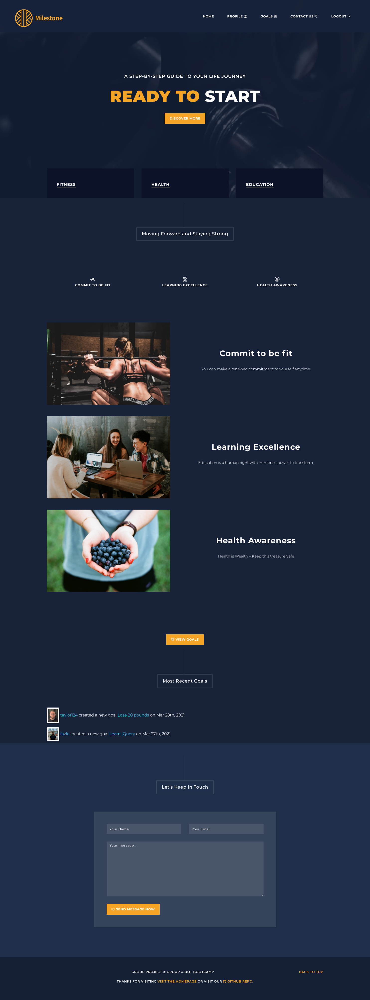
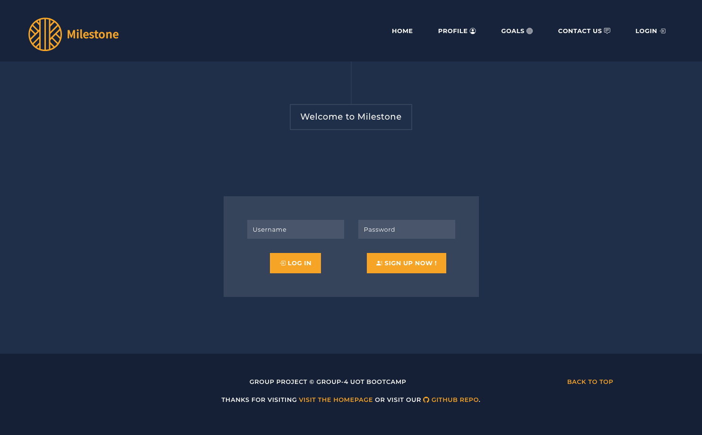
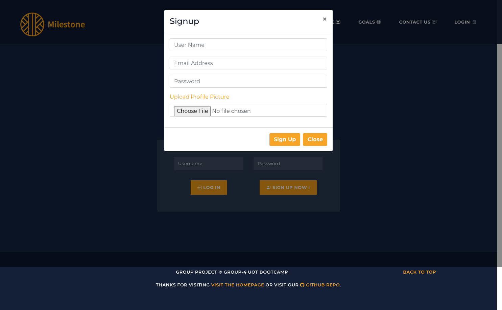
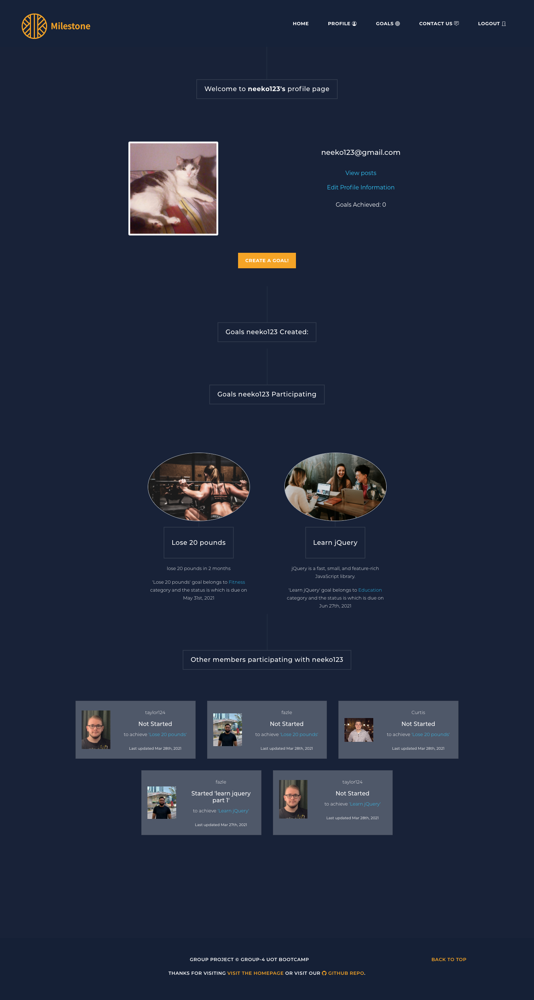
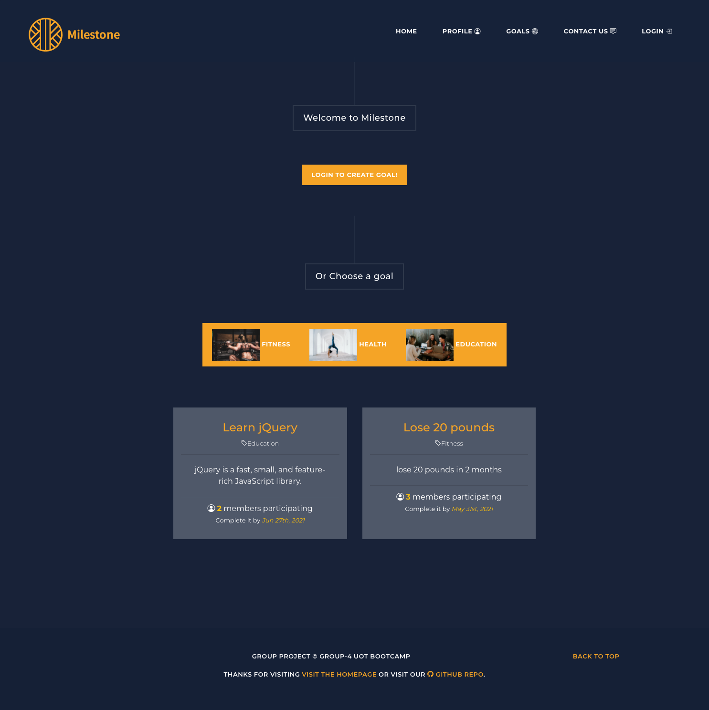
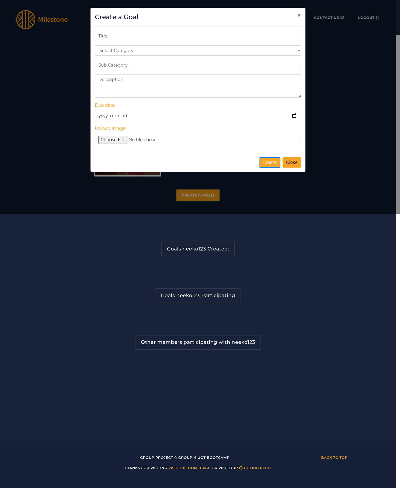
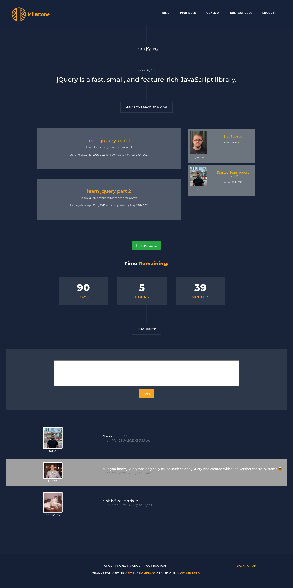
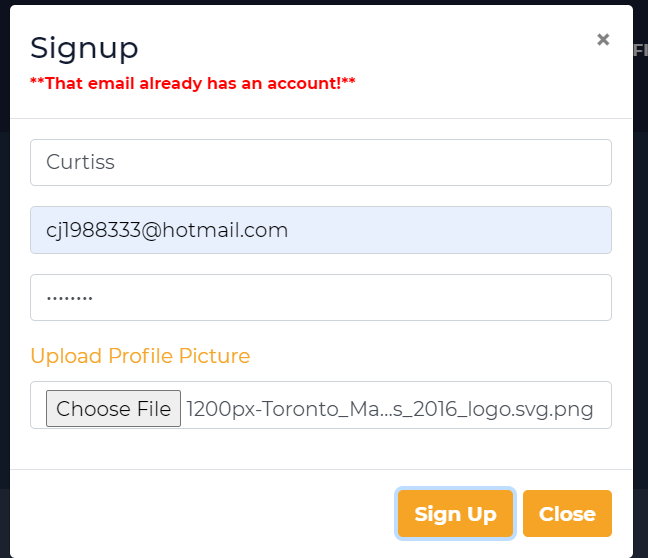
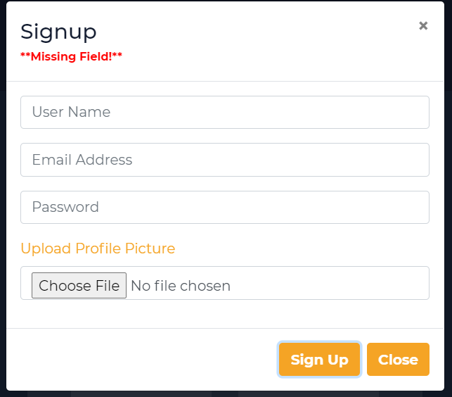

GitHub: [MILESTONE PROJECT](https://github.com/proj2gr4/Milestone-Project)
# Milestone-Project
Project 2 group 4 of UoT Coding BootCamp

The aim of this application is to motivate people to achieve their milestones. Members can create milestones that consist of multiple steps to achieve. They can post it for others to see and track progress. 

# Installation

How to install :
- (MVC) is deployed by using node server.js
- If choosing to use from terminal, open terminal and run 
- make sure you have install the following npm packages:
- "aws-sdk": "^2.874.0",
- "bcrypt": "^5.0.1",
- "connect-session-sequelize": "^7.1.1",
- "dotenv": "^8.2.0",
- "express-handlebars": "^5.2.1",
- "express": "^4.17.1",
- "express-session": "^1.17.1",
- "handlebars": "^4.7.7",
- "mysql2": "^2.2.5",
- "sequelize": "^6.5.0"
- npm start

# Milestone Information
The application functionality:
- Homepage, Dashboard, Login/Logout Navigation.
- Sign Up, Login, Logout, user credentials are saved.
- Create a goal, participate in a goal.
- Add steps to a goal, add comments to a goal.
- Update status in a goal, or cancel participation.
- Able to connect with friends, show their status.
- Profile page can view your own posts.

## Usage
[Milestone Website](https://milestone-goals.herokuapp.com)

## Credits

- Upslash
- Trello
- Creately
- Bootstrap
- Jquery
- Youtube [Website Background](https://www.youtube.com/watch?v=TFO9hBtLVec&t=14s)

## Questions

GitHub: [MILESTONE PROJECT](https://github.com/proj2gr4/Milestone-Project)

## Contributors:
- FAZEL RYAN CHOWDHURY : ryan7998@gmail.com
- CURTIS SMITH : cj1988333@hotmail.com
- HUI SHAN TANG : Neeko_tvxq@hotmail.com
- TAYLOR VAN SCOY : vanscoytaylor@gmail.com

## Screenshots
- Homepage

- Login/Signup page

- Profile Page

- Dashboard

- Create a goal

- Goal Page

----------------------------------------------------------------
- To make the username field in our database unique

## Usage
[Milestone Website](https://milestone-goals.herokuapp.com)

## Credits

- Upslash
- Trello
- Creately
- Bootstrap
- Jquery
- Youtube [Website Background](https://www.youtube.com/watch?v=TFO9hBtLVec&t=14s)

## Questions

GitHub: [MILESTONE PROJECT](https://github.com/proj2gr4/Milestone-Project)

## Contributors:
- FAZEL RYAN CHOWDHURY : ryan7998@gmail.com
- CURTIS SMITH : cj1988333@hotmail.com
- HUI SHAN TANG : Neeko_tvxq@hotmail.com
- TAYLOR VAN SCOY : vanscoytaylor@gmail.com

